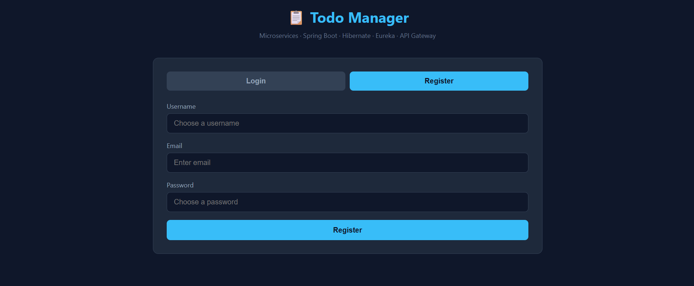
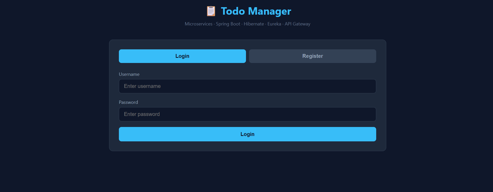
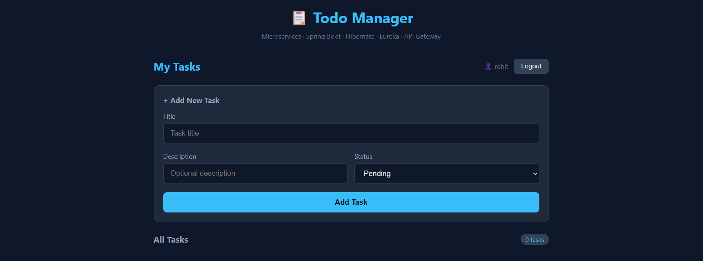
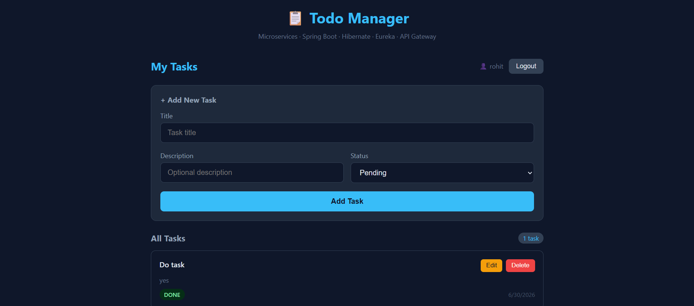
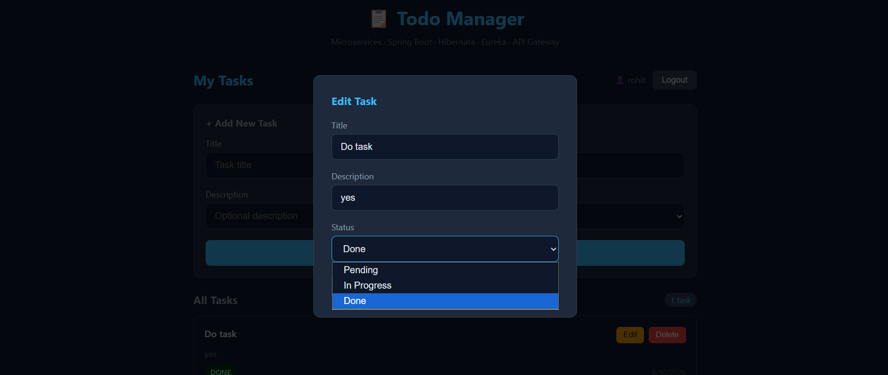

# Todo Manager — Microservices Architecture

A Task Manager application built with Spring Boot, Hibernate, JWT authentication, and a microservices architecture using Eureka Service Discovery and an API Gateway.

## Architecture

```
                    ┌─────────────────┐
                    │  Eureka Server   │  :8761
                    │ (Service Registry)│
                    └────────┬─────────┘
                             │ registers
              ┌──────────────┼──────────────┐
              │              │              │
    ┌─────────▼──────┐ ┌─────▼──────┐ ┌─────▼──────┐
    │  API Gateway    │ │User Service│ │Task Service│
    │     :8080        │ │   :8081    │ │   :8082    │
    └──────────────────┘ └─────┬──────┘ └─────┬──────┘
                                │              │
                          ┌─────▼─────┐  ┌─────▼─────┐
                          │  user_db  │  │  task_db  │
                          │  (MySQL)  │  │  (MySQL)  │
                          └───────────┘  └───────────┘
```

**Frontend** (`index.html`) is served as a static file from User Service (`:8081`) and communicates directly with both User Service and Task Service.

## Screenshots

**Login**


**Register**


**Dashboard — empty state**


**Dashboard — with a task**


**Edit task modal**


## Services

| Service | Port | Responsibility |
|---|---|---|
| Eureka Server | 8761 | Service registry — all services register here on startup |
| API Gateway | 8080 | Routes `/api/users/**` and `/api/tasks/**` to the right service |
| User Service | 8081 | Registration, login, JWT generation and validation |
| Task Service | 8082 | Task CRUD, validates JWT by calling User Service |

## Tech Stack

- **Backend:** Java 21, Spring Boot 3.5.16, Spring Cloud 2025.0.3
- **Database:** MySQL, Hibernate / Spring Data JPA (`ddl-auto=update` — tables auto-created)
- **Auth:** JWT (jjwt 0.11.5), stateless token-based authentication
- **Service Discovery:** Netflix Eureka
- **Routing:** Spring Cloud Gateway
- **Frontend:** Vanilla HTML / CSS / JavaScript (fetch API)

## How Authentication Works

1. User registers / logs in via User Service (`/api/users/register`, `/api/users/login`).
2. User Service generates a signed JWT containing the username and an expiry.
3. Frontend stores the token in `localStorage` and sends it as `Authorization: Bearer <token>` on every task request.
4. Task Service does **not** validate tokens itself — it calls User Service's `/api/users/validate?token=...` endpoint over REST.
5. If valid, User Service returns the username; Task Service uses that to scope task operations to the logged-in user.

This is the core inter-service communication pattern in the project: Task Service depends on User Service for identity, demonstrating separation of concerns across services.

## Project Structure

```
todo-app/
├── eureka-server/      → Service registry
├── api-gateway/        → Spring Cloud Gateway, routes to services via Eureka
├── user-service/       → Auth, JWT, serves frontend static files
│   └── src/main/resources/static/index.html
└── task-service/       → Task CRUD, calls user-service to validate tokens
```

## Setup & Running Locally

### Prerequisites
- Java 21
- Maven
- MySQL (running locally on default port 3306)

### 1. Create databases
```sql
CREATE DATABASE user_db;
CREATE DATABASE task_db;
```

### 2. Update MySQL credentials
In `user-service/application.properties` and `task-service/application.properties`, set your MySQL username/password.

### 3. Start each service (separate terminals, in this order)
```bash
cd eureka-server && mvn spring-boot:run
cd api-gateway && mvn spring-boot:run
cd user-service && mvn spring-boot:run
cd task-service && mvn spring-boot:run
```

### 4. Open the app
```
http://localhost:8081/index.html
```

### 5. Verify service registration
```
http://localhost:8761
```
All four services should appear as `UP`.

## API Endpoints

### User Service (`:8081`)
| Method | Endpoint | Description |
|---|---|---|
| POST | `/api/users/register` | Register a new user |
| POST | `/api/users/login` | Login, returns JWT |
| GET | `/api/users/validate?token=` | Validate a JWT (used internally by Task Service) |

### Task Service (`:8082`)
| Method | Endpoint | Description |
|---|---|---|
| GET | `/api/tasks` | Get all tasks for the logged-in user |
| POST | `/api/tasks` | Create a task |
| PUT | `/api/tasks/{id}` | Update a task |
| DELETE | `/api/tasks/{id}` | Delete a task |

All Task Service endpoints require an `Authorization: Bearer <token>` header.

## Known Limitations / Next Steps

This was built under a tight time constraint (~24 hours) as a take-home interview project, so a few production-readiness items are intentionally left for future iteration:

- **Passwords are stored in plain text** — should use BCrypt hashing.
- **API Gateway routing is configured but the frontend currently calls User Service and Task Service directly** rather than through the gateway, due to a CORS configuration issue encountered during development.
- **No circuit breaker** between Task Service and User Service — if User Service goes down, task requests fail outright instead of degrading gracefully (would add Resilience4J).
- **No containerization** — services run as four separate local processes; Docker Compose would simplify startup to a single command.
- **No input validation / global exception handling** — error responses are minimal.

## What This Project Demonstrates

- Splitting a monolith into independently deployable services with clear single responsibilities
- Service discovery via Eureka instead of hardcoded service URLs
- Stateless authentication with JWT across service boundaries
- Hibernate/JPA for ORM-based persistence with auto-managed schemas
- API Gateway pattern for centralized routing
